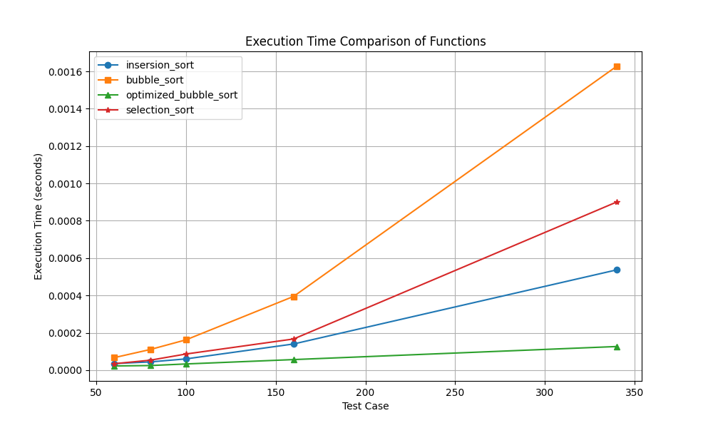

# README

## Overview
This project contains C++ functions for time calculation and a Python script for graphing the results.

## Compilation and Execution

### C++ Functions
1. Navigate to the directory containing the C++ source files.
2. Compile the C++ files using `g++`. For example:
    ```sh
    g++ calculate_time.cpp insersion.cpp bubble.cpp optimizedBubble.cpp selection.cpp -o ./build/calculate_time
    ```
3. Run the compiled executable:
    ```sh
    ./build/calculate_time 
    ```

### Python Script for Graphing
1. Ensure you have Python installed on your system.
2. Install the required Python libraries using `pip`. For example:
    ```sh
    pip install matplotlib numpy 
    ```
    or 
    ```sh
    pip install -r requirements.txt
    ```

3. Run the Python script to generate the graph:
    ```sh
    python graphing_script.py
    ```

## Usage
1. First, compile and run the C++ functions to generate the necessary data.
2. Then, use the Python script to read the data and generate the graph.

## Customization
Feel free to add your own functions and change their definitions to suit your specific needs. Modify the existing C++ files or create new ones, and ensure they are included in the compilation command.

## Dependencies
- C++ Compiler (e.g., g++)
- Python 3.x
- Python libraries: `matplotlib`, `pandas`


## Sample Output

Below is a sample of the graph generated by the Python script:


